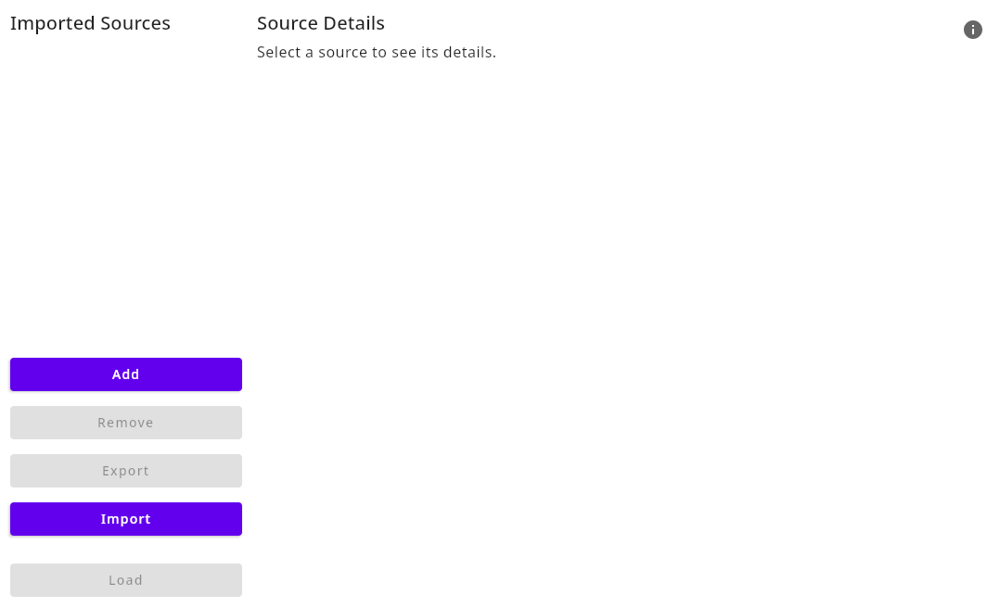
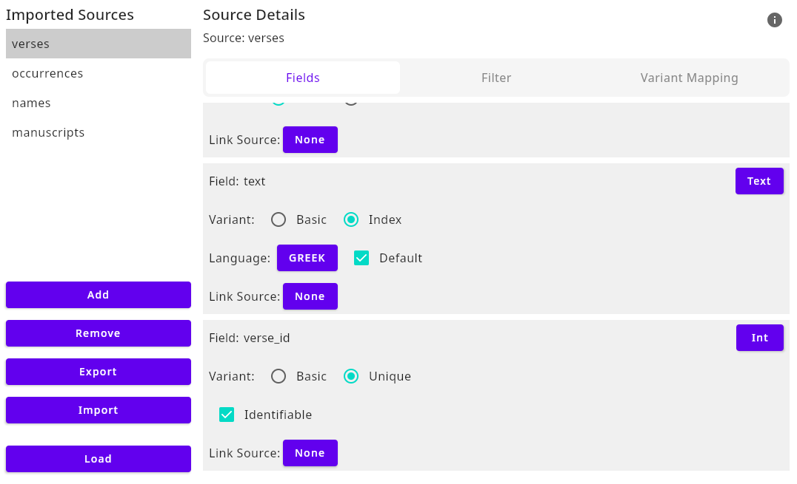
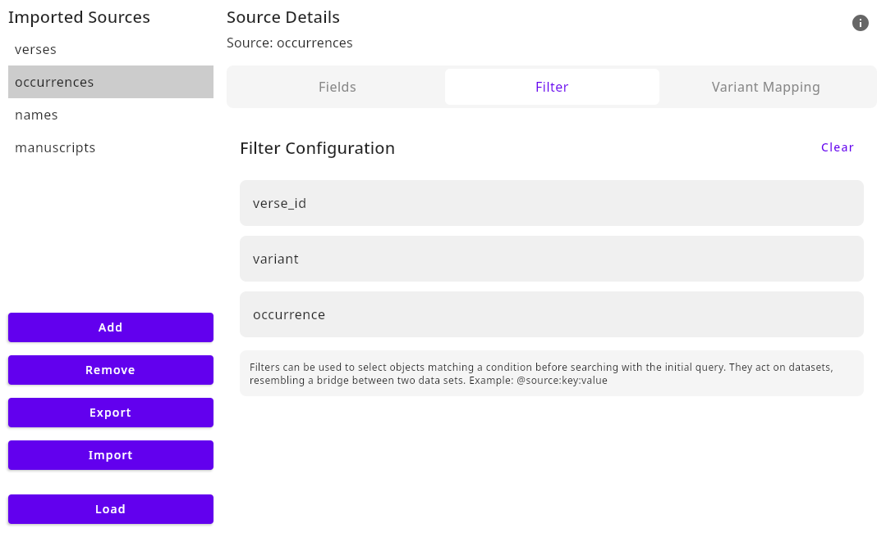
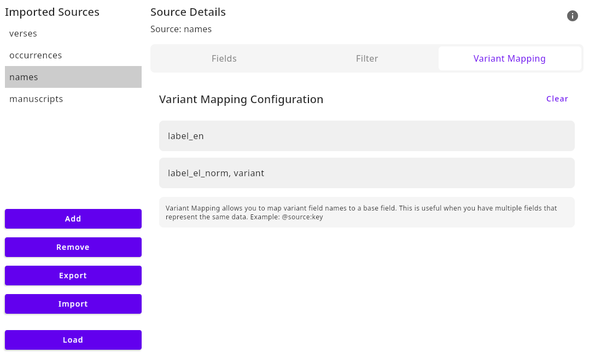
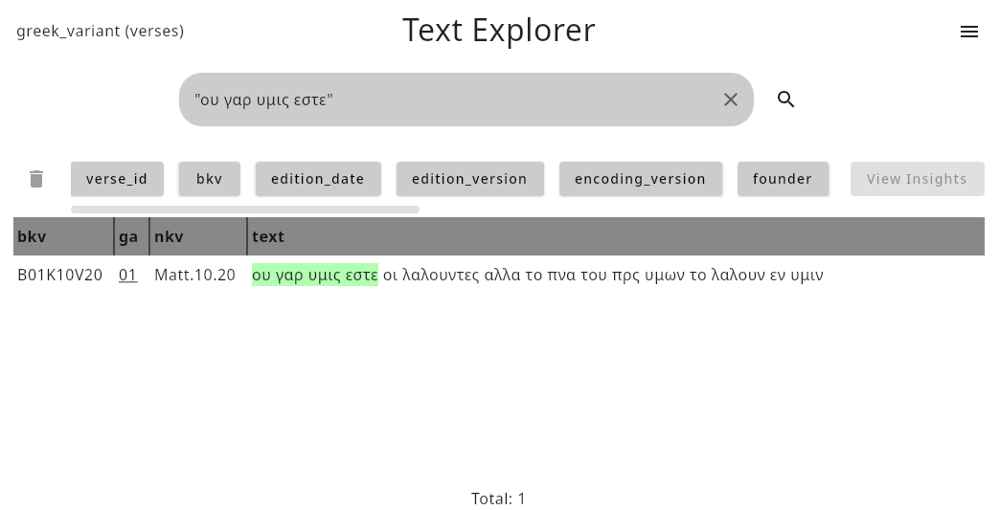
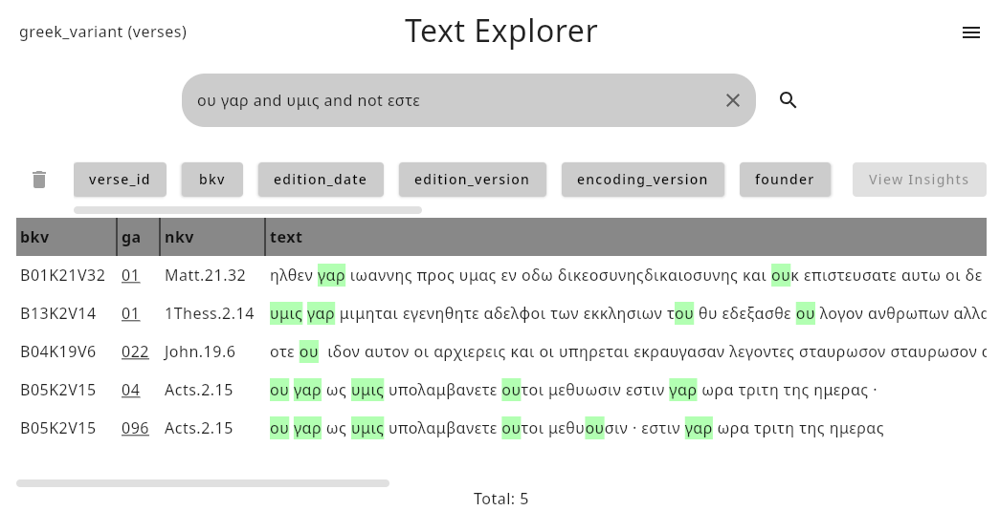
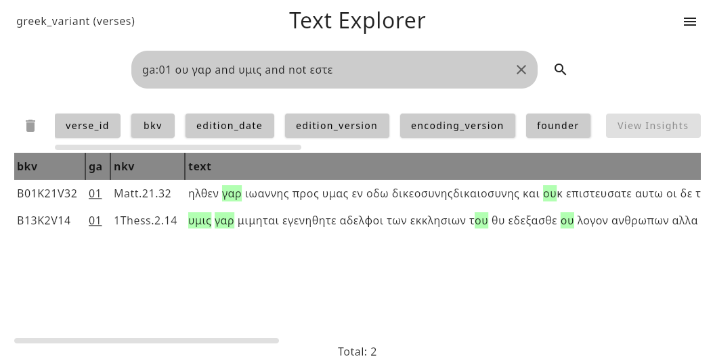
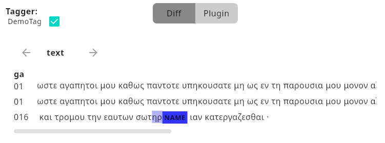
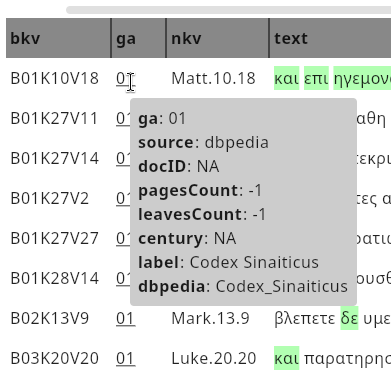

# Usage

All features of the tool in this section are described and demonstrated using the example data set referenced in the [installation section](installation.md).

## Load a Data Set

Data sets can only be loaded though the user interface, via the 'Load Data' menu button in the burger menu in the top right corner of the main screen.

### Data Import

When you open the 'Load Data' menu, the Data Import Window will appear. This window provides five buttons to manage your data sources:

1. **Add**: Use this button to add new source files to the data set. Currently, only CSV files are supported, but more file formats will be supported in the future. Once added, the source files will appear in the list of loaded sources.
2. **Remove**: This button allows you to remove the currently selected source file from the data set.
3. **Export**: Use this button to export the current configuration and data set into a file. This is useful for sharing or backing up your work.
4. **Import**: This button allows you to import a previously saved configuration. Note that after importing, the source files referenced in the configuration must be manually re-added.
5. **Load**: After configuring your data set, click this button to load the data into the application for exploration and analysis.

### Configuring Loaded Sources

Each source file added via the 'Add' button can be configured to tailor the data set to specific requirements. Configuration options include:

#### Fields

Fields represent the individual columns or attributes in the source file and can be assigned one of four types: **Text**, **Int**, **Float**, or **Boolean**. Each field type determines how the data is interpreted and processed by the application.

Certain field types can have additional variants, which define how the data in those fields is handled:

- **Text**: Can be set as either _Basic_ or _Index_.
- **Int**: Can be set as either _Basic_ or _Unique_.

- **Basic**: Indicates that the field values are treated as standard data without any special handling.
- **Index** (for Text fields): Adds properties such as:
  - **Language**: Specifies the language of the data for indexing purposes. Currently, only one language per field is supported.
  - **Default**: Marks the field as the default for searches, allowing queries to omit specifying the field explicitly. Only one default field is allowed per data set, and at least one index field is required. The source file containing the index field becomes the **main source file**, which is used to display all data from the source (e.g., if the source CSV file has columns like `text`, `author`, and `year`, all columns will be displayed unless disabled).
- **Unique** (for Int fields): Adds the **Identifiable** property, which designates the field as the unique identifier for the source. It optimizes the initial data loading process and is needed for the **Filter** feature for identification.

**Float** and **Boolean** fields do not support additional properties or variants.

Every field also includes a **Link** option, which is particularly useful for the main source file. This feature enables linking fields in the main source to fields in other source files by identical fields, allowing for relationships between data sets. For example, if the main source contains a field called `author` and another source file contains detailed information about authors, the linked source can be used to fetch and display additional information during queries. Note that linked sources are not searchable, and links are unidirectional, flowing from the main source to the linked source (e.g., `main source -> linked source`).

#### Filter

The Filter tab is where pre-filtering is configured. Pre-filtering selects a set of entries based on linked conditions when used in a search. This configuration consists of setting filter conditions and links. For this configuration to work, a link must exist in the current source.

The filter configuration consists of three key elements:
- **Key**: A field in the main source that uniquely identifies each entry.
- **Link Key**: A field in the linked source whose value is used to evaluate conditions.
- **Value**: A field in the current source that stores the value for conditional lookups.

For more details on how to use variants in searches, see [Pre-filtering](#pre-filtering).

#### Variant Mapping

Variant Mapping is used to unify multiple fields into a single representation.

The **Base Field** is the primary field used for the representation. For example, if a data set contains Greek names and their English translations, the base field would be the one containing the English names (e.g., "Jesus"). It is important to note that the base field itself is not used when searching for variants; only the values from the fields specified in the **Variants** textbox are considered during searches.

The **Variants** textbox accepts a comma-separated list of fields from the source file that contain the variations of the base field. For instance, these fields might include translations or alternative spellings of a name.

**Example**

Consider a data set where:

- The column `label_en` contains the English translation of each name.
- The columns `label_el_norm` and `variant` contain the Greek translations and other variants of the names.

The data should be structured as follows:

| label_en | label_el_norm | variant  |
|----------|---------------|----------|
| name1    | translation1  | variant1 |
| name1    | translation2  | variant2 |
| name1    | translation1  | variant3 |
| name1    | translation1  | variant4 |

In this case:

- `label_en` would be the **Base Field**.
- `label_el_norm` and `variant` would be specified in the **Variants** textbox.

The application will then group all translations and variants (e.g., `translation1`, `translation2`, `variant1`, `variant2`, etc.) as representations of `name1`.

For more details on how to use variants in searches, see [Variant Search](#variant-search).

## Load a Plugin

There are two options to load plugins:

1. Use the 'Load Plugin' button in the burger menu in the top right corner of the main screen. A file dialog will open, allowing you to select the plugin jar file. Once selected, the plugin will be loaded and its functionality will be available in the application.
2. Manually place the plugin jar file in the `plugins` directory, which is located in the `.textexplorer` directory in your home directory. The plugin will be automatically loaded when you start the application.

## Exploration of Data

The exploration of data in this tool is divided into two main features: **Search** and **Insights**.

The **Search** functionality allows users to perform various types of searches, including normal, exact, boolean, field-specific, and variant searches, with options for pre-filtering results.

The **Insights** feature provides tools for comparing data through a diff and tagging view for better insights.

### Search

The search features offer different ways to explore the data within the application. These range from a simple search, designed for a broader and more loosely defined search, to an exact search for pinpointing specific terms or phrases.

A normal search consists of entering one or more terms into the search field, where the application will return a result table of entries that contain at least one of the specified terms.

For a more precise search, wrap the query in quotes (e.g., "Term1 Term2 Term3") to search for the exact order of terms.

#### Boolean Search

Boolean search allows you to refine your search by logically connecting terms using operators such as `AND`, `OR`, `AND NOT`, and parentheses `()` for grouping. For example:

- Use `AND` to return results that contain all the specified terms (e.g., `Term1 AND Term2`).
- Use `OR` to return results that contain either of the specified terms (e.g., `Term1 OR Term2`).
- Use `AND NOT` to exclude terms from the results (e.g., `Term1 AND NOT Term2`).
- Use parentheses to group terms and define the order of operations (e.g., `(Term1 OR Term2) AND Term3`).

#### Field Search

With field search, you can target specific fields in the dataset by specifying a field and its corresponding value. This allows precise filtering based on pre-defined field values. For instance:

- Use `ga:01` to return all matching entries where the field `ga` has the value `01`.
- Multiple field-specific filters can be combined to narrow down the results further.

#### Variant Search

Variant search enables you to search for different variations of terms that often represent the same concept. For example, terms like `America`, `USA`, `US`, and `United States` may all refer to the same entity in your data set. These variants are configured during the data set loading process (see [Load a Data Set](#load-a-data-set)).

To search for such variants, use the syntax `@source:value`, where:

- **source** specifies the field to search within.
- **value** represents the label associated with the term(s) you want to find.

For instance:

- `@name:Jesus` searches all entries where the field `name` contains terms associated with the label _Jesus_.

#### Pre filtering

Pre-filtering enables the pre-selection of entries based on linked conditions and criteria, allowing for targeted filtering in cases where multiple data sources are interconnected. Unlike simple field searches, pre-filtering draws from data relationships configured during the data set loading process (see [Load a Data Set](#load-a-data-set)). These relationships point to different fields and values across multiple sources.
For example, the example data set provided in the [installation section](installation.md) includes a file that indicates whether a specific name or token is present or missing in certain phrases. These conditions are established in the configuration of the data set itself, not by the application.
The syntax for pre-filtering is: `@source:value1:value2`

Where:

- **source** specifies the source entry to search within.
- **value1** refers to the linked value to evaluate.
- **value2** specifies the state or condition to filter for.

### Example:

- `@occurrences:ανδρεου:False` pre-selects all entries that should contain `ανδρεου` (as indicated in the data set) but do not.

**Important**: The required information must be present in the data set. The application is only capable of interpreting and processing the provided information and it cannot generate or offer functionality for data that has not been included.

### Insights

These features offer enhanced data insights. Specifically, the application highlights differences between selected entries per field and words or subwords tagged via the Tagging API (see [Development](dev.md)).

Insights can be accessed by selecting one or more entries in the result table, which enables the corresponding button in the top-right corner above the results.

The diff view displays additions in green and deletions in red, providing a clear comparison between selected entries. The top entry serves as the baseline for comparison with the entries below. Use the arrow next to the text to promote a different entry for comparison. The arrow menu on the left side allows switching between fields. Plugins can define which fields are always visible (e.g., ga) and selectable (see [Development](dev.md)).

The Tagger can be enabled and switched in the top-left corner (e.g., DemoTag) and highlights matches with the corresponding tag provided by the plugin (see [Development](dev.md)).

UI extensions from plugins (see [Development](dev.md)) are also available within the 'Insights' section. To access visualizations or insights provided by plugins, switch to the 'Plugins' tab located at the top-center (see images above). Switching between different plugin views is possible.

### Links

The fetched link information is displayed in the result table with underlined text. These fields are hoverable, revealing additional information about the corresponding object.

## Settings

A few settings are available in the burger menu in the top-right corner of the screen. These settings will mostly affect the user interface and how the data is displayed. These settings include:

- **Width Limit**: Toggles between a fixed width for the result table and a dynamic width that adjusts to the content.
- **Exact Highlighting**: Enables or disables exact highlighting of search results in the result table. When enabled, only exact matching terms will be highlighted in the result table. When disabled, even matching substrings will be highlighted.

Certain columns of the result table can be disabled to reduce clutter. These can be toggled on or off per column by clicking the corresponding button in the button list above the result table (e.g., verse_id, bkv, edition_date, edition_version, etc.).

The tool is able to manage multiple data sets at the same time. You can switch between data sets using the dropdown menu in the top-left corner of the screen.

The settings menu is likely to change in the future, so please check the documentation for updates.

## Logs

In case of a crash or other issues, the application logs its output to a file named `log.txt`. This file is located in the `.textexplorer` directory within your home directory. Please include this file when [reporting an issue](https://github.com/Paulanerus/TextExplorer/issues) on GitHub.
